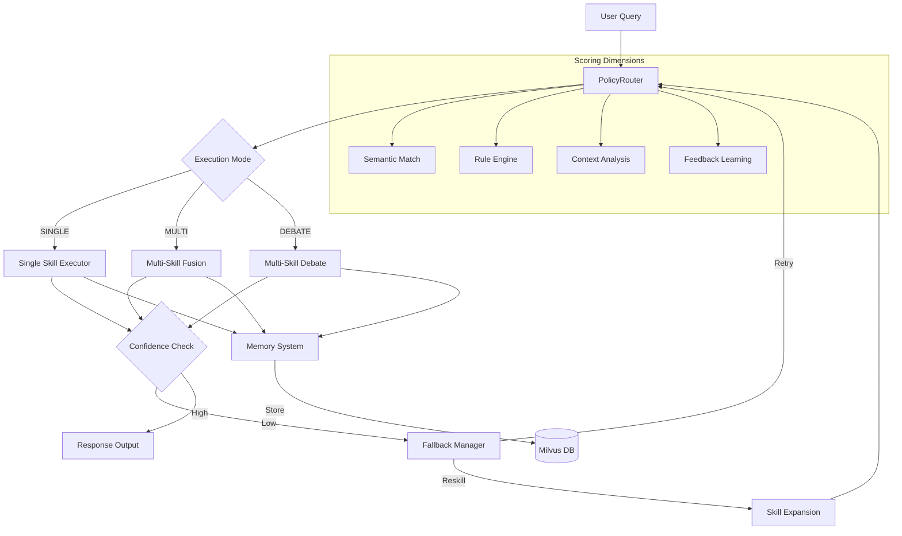
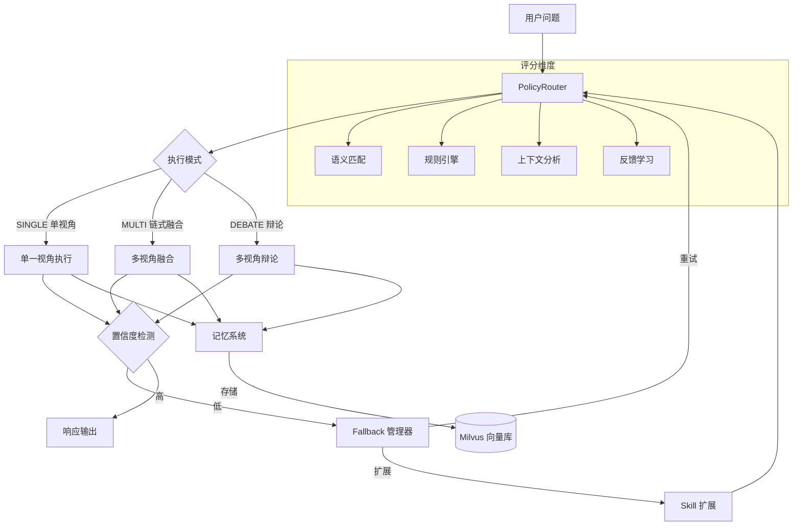

# DialecticEngine

## Why DialecticEngine?

Compared with existing frameworks:

- **LangChain**：流程驱动（Workflow），缺少动态决策能力
- **AutoGPT**：Agent能力强，但稳定性与可控性较差
- **本项目**：引入"策略路由 + 多维评分"，实现可控的多Agent协同决策

核心优势：
- **可解释**（决策路径可追踪）
- **可控**（规则+评分约束）
- **可扩展**（Skill模块化）

---

[English](#english) | [中文](#中文)

---

# English

## Multi-perspective Philosophical Reasoning Engine | Smart Skill Routing | DeepSeek LLM

[](https://www.python.org/)
[](LICENSE)

### Core Features

- **Smart Routing**: Multi-signal routing decisions based on semantic matching, rule engine, and user feedback
- **Multi-perspective Fusion**: Supports single-perspective analysis, multi-perspective chain fusion, and debate dialogue modes
- **Long-term Memory**: Milvus vector database for storing historical decisions with similarity search
- **Fallback Mechanism**: Automatic query rewriting or Skill expansion on low confidence
- **Streaming Output**: Real-time streaming generation with perspectives speaking in sequence

### Technical Architecture



### Core Modules

| Module | Responsibility |
|--------|----------------|
| `policy_router/` | Smart routing: feature extraction, rule matching, multi-signal scoring |
| `harness/` | Adjudicator: conflict detection, Fallback management |
| `milvus_DB/` | Vector database: storage, similarity search |
| `skills/` | Perspective library: 20+ traditional philosophy perspectives |
| `tools/` | Utilities: Docker management, Embedding generation |

### Tech Stack

- **LLM**: DeepSeek Chat API
- **Vector DB**: Milvus (GPU_CAGRA / HNSW index)
- **Embedding**: BAAI/bge-base-zh-v1.5 (Chinese optimized)
- **Framework**: LangGraph, FastAPI
- **Language**: Python 3.10+

### Use Cases

| Scenario | Description | Execution Mode |
|----------|-------------|----------------|
| **Intelligent Customer Service** | Multi-strategy response generation (rigorous/comforting/sales) | SINGLE or DEBATE |
| **Enterprise Knowledge Q&A** | Multi-perspective analysis and suggestion generation | MULTI |
| **Decision Support System** | Result comparison under different strategies | MULTI |
| **Multi-Agent Collaborative Tasks** | Planning / Analysis / Execution coordination | DEBATE |

### Quick Start

**Environment Setup**

```bash
pip install -r requirements.txt
cp .env.example .env
# Edit .env with DEEPSEEK_API_KEY
```

**Start Milvus (Optional)**

```bash
cd milvus_DB
docker compose up -d
python create_collections.py
```

**Run**

```python
from main_entry import DialecticEngine

engine = DialecticEngine(
    long_term_memory_enabled=True,
    llm_temperature=0.7,
)
result = engine.chat("Should I speak up when I disagree with my boss?")
print(result["response"])
```

**CLI Mode**

```bash
python main_entry.py
```

### Skill Perspectives

| Perspective | Core Philosophy | Use Cases |
|-------------|----------------|-----------|
| Confucianism | Benevolence, Righteousness, Propriety | Interpersonal relationships, Moral dilemmas |
| Taoism | Naturalness, Non-action | Going with the flow, Letting go |
| Legalism | Law and punishment, Efficiency | Management decisions, System design |
| Mohism | Inclusive care, Utility | Social fairness, Collective interests |
| School of Names | Concept clarification | Logical analysis |
| Yin-Yang | Balance, Dynamic harmony | Complex decisions, System equilibrium |
| Military Strategy | Strategic thinking | Competition, Risk decisions |
| ... | ... | ... |

### Project Structure

```
DialecticEngine/
+-- main_entry.py           # Main entry + CLI
+-- policy_router/          # Smart routing core
|   +-- router.py          # PolicyRouter class
|   +-- features.py         # Feature extraction
|   +-- scorer.py          # Multi-signal scoring
|   +-- fusion.py          # Decision fusion
|   +-- registry_adapter.py
+-- harness/               # Adjudication & protection
|   +-- adjudicator.py     # Adjudicator
|   +-- conflict_detector.py
|   +-- fallback_manager.py # Fallback mechanism
+-- milvus_DB/             # Vector database
|   +-- long_term_memory.py
|   +-- client.py
|   +-- operations/
+-- skills/                # 20+ philosophical perspectives
|   +-- rujia-perspective/
|   +-- daojia-perspective/
|   +-- ...
+-- tools/                 # Utilities
    +-- docker_tools.py
    +-- embedding_tools.py
```

### Key Innovations

1. **Modernizing Traditional Wisdom**: Systematizing ancient Chinese philosophical thought as engineering solutions
2. **Multi-signal Routing**: Fusing semantic, rule-based, and historical feedback signals
3. **Chain Multi-perspective Interaction**: Perspectives see each other's views for true intellectual collision
4. **Confidence-adaptive Fallback**: Automatic fallback on low confidence to ensure answer quality

### Evaluation

| Metric | Description | Target |
|--------|-------------|--------|
| **Routing Accuracy** | Correct skill selection rate for single-perspective queries | > 85% |
| **Multi-perspective Fusion** | Quality score for chain fusion responses (1-5) | > 4.0 |
| **Response Stability** | Variance in repeated query responses | < 15% |
| **Fallback Effectiveness** | Success rate of fallback recovery | > 70% |

### Limitations

- **Multi-Agent Conflicts**: In DEBATE mode, conflicting perspectives may require additional adjudication overhead
- **Routing Weight Sensitivity**: System performance depends on proper tuning of scoring weights (semantic/rule/context/feedback)
- **Memory Bias**: Historical decisions stored in Milvus may introduce recency bias in similarity search
- **Skill Coverage**: Response quality degrades for queries outside defined philosophical perspective domains

---

# 中文

## 多视角哲学推理引擎 · 智能路由 · DeepSeek LLM

### 核心特性

- **智能路由**：基于语义匹配、规则引擎和用户反馈的 Multi-signal 路由决策
- **多视角融合**：支持单一视角深入分析、多视角链式融合、辩论对话三种模式
- **长期记忆**：基于 Milvus 向量数据库存储历史决策，支持相似问题检索
- **Fallback 机制**：低置信度时自动触发问题重写或 Skill 扩展
- **流式输出**：实时流式生成回答，支持多视角依次发言

### 技术架构



### 核心模块

| 模块 | 职责 |
|------|------|
| `policy_router/` | 智能路由：特征提取、规则匹配、多信号评分融合 |
| `harness/` | 裁决器：冲突检测、Fallback 管理 |
| `milvus_DB/` | 向量数据库：存储、相似检索 |
| `skills/` | 视角库：20+ 传统哲学视角 |
| `tools/` | 工具集：Docker 管理、Embedding 生成 |

### 技术栈

- **LLM**: DeepSeek Chat API
- **向量数据库**: Milvus (GPU_CAGRA / HNSW 索引)
- **Embedding**: BAAI/bge-base-zh-v1.5 (中文优化)
- **框架**: LangGraph, FastAPI
- **语言**: Python 3.10+

### 应用场景

| 场景 | 描述 | 执行模式 |
|------|------|----------|
| **智能客服** | 多策略回复生成（严谨/安抚/销售） | SINGLE 或 DEBATE |
| **企业知识问答** | 多视角分析与建议生成 | MULTI |
| **决策支持系统** | 不同策略下的结果对比 | MULTI |
| **多Agent协同任务** | 规划 / 分析 / 执行协调 | DEBATE |

### 快速开始

**环境配置**

```bash
pip install -r requirements.txt
cp .env.example .env
# 编辑 .env 填入 DEEPSEEK_API_KEY
```

**启动 Milvus (可选)**

```bash
cd milvus_DB
docker compose up -d
python create_collections.py
```

**运行**

```python
from main_entry import DialecticEngine

engine = DialecticEngine(
    long_term_memory_enabled=True,
    llm_temperature=0.7,
)
result = engine.chat("我和老板意见不合，该直言吗？")
print(result["response"])
```

**CLI 交互**

```bash
python main_entry.py
```

### Skill 视角体系

| 视角 | 核心思想 | 适用场景 |
|------|----------|----------|
| 儒家 | 仁义礼智、修身齐家 | 人际关系、道德困境 |
| 道家 | 道法自然、无为而治 | 顺势而为、放下执念 |
| 法家 | 法治刑赏、实用效率 | 管理决策、制度设计 |
| 墨家 | 兼爱非攻、实用功利 | 社会公平、集体利益 |
| 名家 | 名实相符、逻辑辨析 | 概念澄清、逻辑分析 |
| 阴阳家 | 阴阳调和、动态平衡 | 复杂决策、系统平衡 |
| 兵家 | 战略全局、知己知彼 | 竞争策略、风险决策 |
| ... | ... | ... |

### 项目结构

```
DialecticEngine/
+-- main_entry.py           # 主入口 + CLI
+-- policy_router/          # 智能路由核心
|   +-- router.py          # PolicyRouter 主类
|   +-- features.py         # 特征提取
|   +-- scorer.py          # 多信号评分
|   +-- fusion.py          # 决策融合
|   +-- registry_adapter.py
+-- harness/               # 裁决与保障
|   +-- adjudicator.py     # 裁决器
|   +-- conflict_detector.py
|   +-- fallback_manager.py # Fallback 机制
+-- milvus_DB/             # 向量数据库
|   +-- long_term_memory.py
|   +-- client.py
|   +-- operations/
+-- skills/                # 20+ 哲学视角
|   +-- rujia-perspective/
|   +-- daojia-perspective/
|   +-- ...
+-- tools/                # 工具集
    +-- docker_tools.py
    +-- embedding_tools.py
```

### 核心创新

1. **传统智慧的现代化**：将中国古代哲学思想体系化、工程化
2. **Multi-signal 路由**：融合语义、规则、历史反馈多维信号
3. **链式多视角交互**：视角间可见彼此观点，实现真正的思想碰撞
4. **置信度自适应 Fallback**：低置信度自动触发，保证回答质量

### 系统评估

| 指标 | 描述 | 目标值 |
|------|------|--------|
| **路由准确率** | 单一视角查询的正确技能选择率 | > 85% |
| **多视角融合质量** | 链式融合响应的质量评分 (1-5) | > 4.0 |
| **响应稳定性** | 重复查询响应的方差 | < 15% |
| **Fallback有效性** | Fallback恢复的成功率 | > 70% |

### 系统局限

- **多Agent冲突**：DEBATE模式下，冲突视角可能需要额外的裁决开销
- **路由权重敏感性**：系统性能依赖评分权重的合理调优（语义/规则/上下文/反馈）
- **记忆偏差**：存储在Milvus中的历史决策可能在相似性检索中引入近因偏差
- **Skill覆盖范围**：超出定义的哲学视角领域时，响应质量会下降

---

## License

MIT
