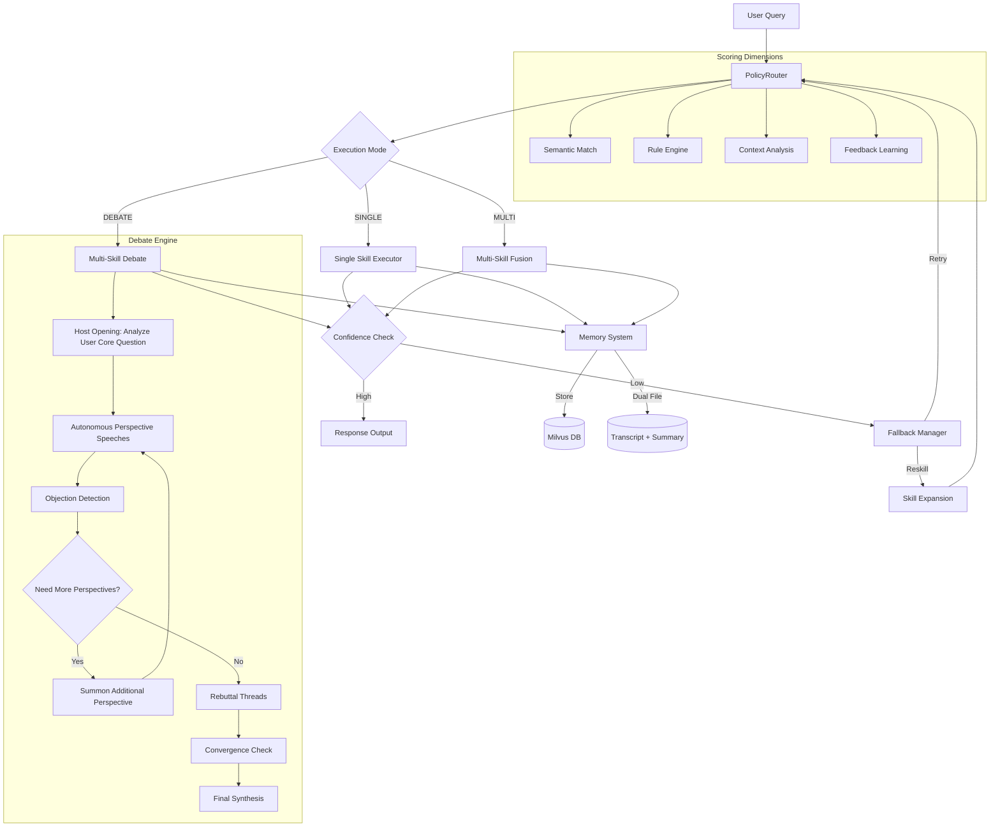
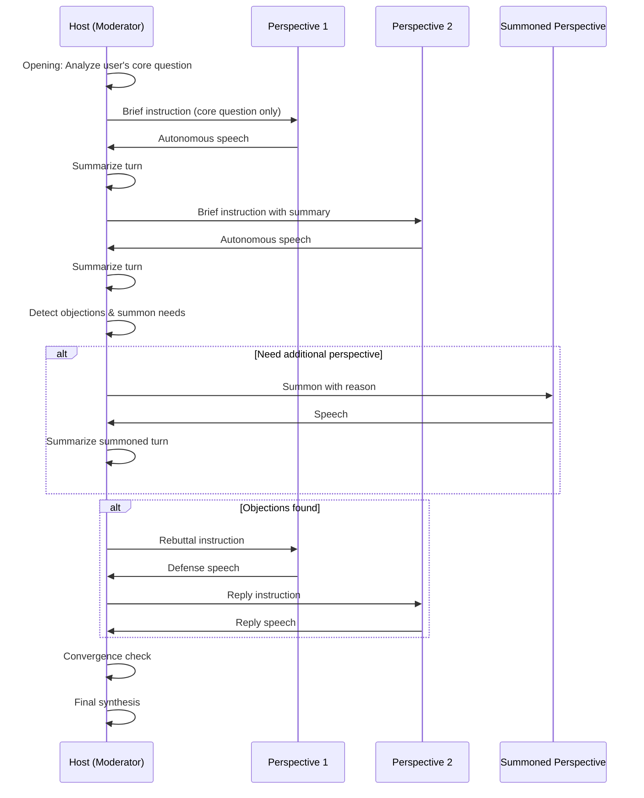
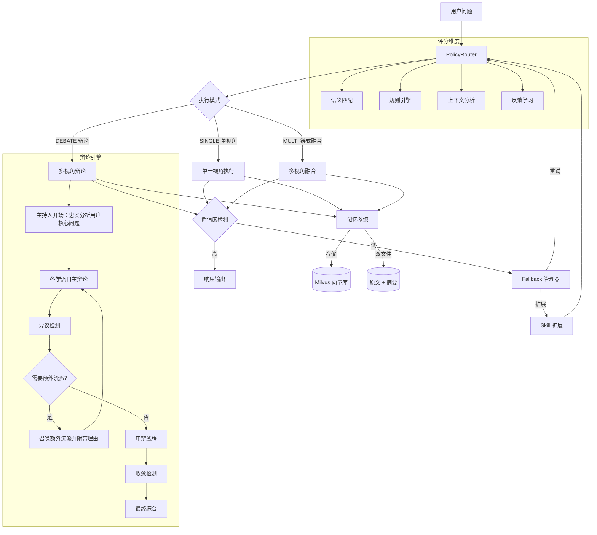
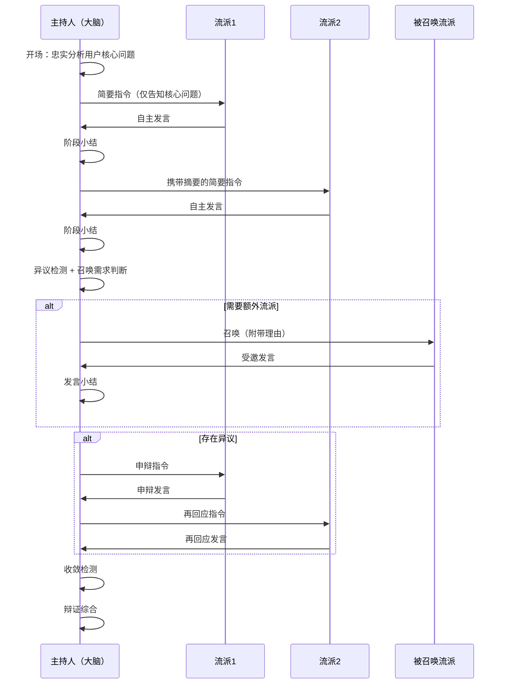

# DialecticEngine

## Why DialecticEngine?

Compared with existing frameworks:

- **LangChain**：流程驱动（Workflow），缺少动态决策能力
- **AutoGPT**：Agent能力强，但稳定性与可控性较差
- **本项目**：引入"策略路由 + 多维评分"，实现可控的多Agent协同决策

核心优势：
- **可解释**（决策路径可追踪）
- **可控**（规则+评分约束）
- **可扩展**（Skill模块化）

---

[English](#english) | [中文](#中文)

---

# English

## Multi-perspective Philosophical Reasoning Engine | Smart Skill Routing | DeepSeek LLM

[](https://www.python.org/)
[](LICENSE)

### Core Features

- **Smart Routing**: Multi-signal routing decisions based on semantic matching, rule engine, and user feedback
- **Multi-perspective Fusion**: Supports single-perspective analysis, multi-perspective chain fusion, and debate dialogue modes
- **Autonomous Debate**: Perspectives debate independently based on their own philosophical frameworks, not following host-prescribed angles
- **Dynamic Perspective Summoning**: The host can summon additional philosophical perspectives during debate when current perspectives are insufficient to cover important dimensions
- **Debate Convergence Control**: Global round limits, objection pair deduplication, and convergence detection to prevent infinite debate loops
- **Dual-layer Memory**: Short-term memory (same-session history summaries auto-injected) + Long-term memory (dual-file system with cross-session retrieval)
- **Streaming Output**: Real-time SSE streaming with throttled Markdown rendering, no blocking overlays
- **Web Search Integration**: Optional web search with collapsible results panel to supplement philosophical analysis with factual information
- **Fallback Mechanism**: Automatic query rewriting or Skill expansion on low confidence
- **Frontend UX**: Per-turn screenshot export, multi-format export (HTML/Markdown/Print), collapsible perspective sections, interrupt button with memory preservation, responsive design

### Technical Architecture



### Core Modules

| Module | Responsibility |
|--------|----------------|
| `main_entry.py` | Main entry: SkillExecutor, DialecticEngine, CLI |
| `debate_orchestrator.py` | Debate host engine: opening, speech, objection detection, perspective summoning, rebuttal, synthesis |
| `api_flask.py` | Flask API: streaming endpoint, memory save/load, web search |
| `memory_store.py` | Memory management: dual-file storage (transcript + summary), similarity retrieval |
| `policy_router/` | Smart routing: feature extraction, rule matching, multi-signal scoring |
| `harness/` | Adjudicator: conflict detection, Fallback management |
| `milvus_DB/` | Vector database: storage, similarity search |
| `skills/` | Perspective library: 21 traditional philosophy perspectives |
| `frontend/` | Web frontend: streaming display, collapsible sections, screenshot, responsive design |
| `tools/` | Utilities: Docker management, Embedding generation |

### Tech Stack

- **LLM**: DeepSeek Chat API
- **Backend**: Flask (SSE streaming), Python 3.10+
- **Frontend**: Vanilla JS, Marked.js, DOMPurify, html2canvas
- **Vector DB**: Milvus (GPU_CAGRA / HNSW index)
- **Embedding**: BAAI/bge-base-zh-v1.5 (Chinese optimized)
- **Framework**: LangGraph, FastAPI
- **Language**: Python 3.10+

### Use Cases

| Scenario | Description | Execution Mode |
|----------|-------------|----------------|
| **Intelligent Customer Service** | Multi-strategy response generation (rigorous/comforting/sales) | SINGLE or DEBATE |
| **Enterprise Knowledge Q&A** | Multi-perspective analysis and suggestion generation | MULTI |
| **Decision Support System** | Result comparison under different strategies | MULTI |
| **Multi-Agent Collaborative Tasks** | Planning / Analysis / Execution coordination | DEBATE |

### Quick Start

**Environment Setup**

```bash
pip install -r requirements.txt
cp .env.example .env
# Edit .env with DEEPSEEK_API_KEY
```

**Start Milvus (Optional)**

```bash
cd milvus_DB
docker compose up -d
python create_collections.py
```

**Run Backend**

```bash
python api_flask.py
```

**Run CLI Mode**

```bash
python main_entry.py
```

**Python API**

```python
from main_entry import DialecticEngine

engine = DialecticEngine(
    long_term_memory_enabled=True,
    llm_temperature=0.7,
)
result = engine.chat("Should I speak up when I disagree with my boss?")
print(result["response"])
```

### Skill Perspectives (21 Perspectives)

| Perspective | Core Philosophy | Use Cases |
|-------------|----------------|-----------|
| Confucianism (儒家) | Benevolence, Righteousness, Propriety, Self-cultivation | Interpersonal relationships, Moral dilemmas |
| Taoism (道家) | Naturalness, Non-action, Following the Way | Going with the flow, Letting go |
| Legalism (法家) | Law and punishment, Centralized authority, Efficiency | Management decisions, System design |
| Mohism (墨家) | Inclusive care, Anti-war, Utility | Social fairness, Collective interests |
| School of Names (名家) | Name-reality correspondence, Logical analysis | Concept clarification, Logical analysis |
| Yin-Yang (阴阳家) | Yin-Yang harmony, Five Elements, Dynamic balance | Complex decisions, System equilibrium |
| Buddhism (佛家) | Dependent origination, Emptiness, Inner peace | Detachment, Mindfulness |
| Military Strategy (兵家) | Strategic thinking, Know self and enemy | Competition, Risk decisions |
| School of Mind (心学) | Mind is principle, Innate knowing, Unity of knowledge and action | Self-reflection, Practical wisdom |
| Neo-Confucianism (理学) | Investigate things, Preserve heavenly principles | Rational cultivation, Moral discipline |
| New Confucianism (新儒) | East-West synthesis, Critical inheritance | Modern transformation of tradition |
| Diplomacy (纵横家) | Alliance strategies, Persuasion, Weighing interests | Negotiation, Strategic positioning |
| Historiography (史家) | Learning from history, Past-present continuity | Historical wisdom, Pattern recognition |
| Eclecticism (杂家) | Inclusiveness, Drawing from all schools | Pragmatic synthesis, Contextual adaptation |
| Huang-Lao (黄老) | Quiet non-action, Virtue and law combined | Governance, Soft power |
| Medicine (医家) | Healing, Mind-body unity, Harmonizing Yin-Yang | Health decisions, Holistic wellbeing |
| Classics (经学) | Textual exegesis, Practical application of classics | Scholarly rigor, Tradition preservation |
| Agriculture (农家) | Farming as foundation, Practicality, Seasonal wisdom | Down-to-earth decisions, Sustainability |
| Fiction (小说家) | Stories as moral lessons, Observing human nature | Empathy, Understanding social dynamics |
| Divination (术数家) | Symbolic reasoning, Heaven-human correspondence | Pattern recognition, Strategic timing |
| Xuanxue (玄学) | Revering the formless, Forgetting words for meaning | Abstract reasoning, Beyond conventions |

### Debate Flow



### Project Structure

```
DialecticEngine/
+-- main_entry.py           # Main entry + SkillExecutor + DialecticEngine
+-- debate_orchestrator.py  # Debate host engine: orchestration, summoning, rebuttal
+-- api_flask.py            # Flask API: SSE streaming, memory, search
+-- memory_store.py         # Dual-file memory: transcript + summary
+-- web_search.py           # Web search integration
+-- policy_router/          # Smart routing core
|   +-- router.py          # PolicyRouter class
|   +-- features.py         # Feature extraction
|   +-- scorer.py          # Multi-signal scoring
|   +-- fusion.py          # Decision fusion
|   +-- registry_adapter.py
+-- harness/               # Adjudication & protection
|   +-- adjudicator.py     # Adjudicator
|   +-- conflict_detector.py
|   +-- fallback_manager.py # Fallback mechanism
+-- milvus_DB/             # Vector database
|   +-- long_term_memory.py
|   +-- client.py
|   +-- operations/
+-- skills/                # 21 philosophical perspectives
|   +-- rujia-perspective/
|   +-- daojia-perspective/
|   +-- fajia-perspective/
|   +-- mojia-perspective/
|   +-- mingjia-perspective/
|   +-- yinyangjia-perspective/
|   +-- fojia-perspective/
|   +-- bingjia-perspective/
|   +-- xinxue-perspective/
|   +-- lixue-perspective/
|   +-- zonghengjia-perspective/
|   +-- shijia-perspective/
|   +-- zajia-perspective/
|   +-- huanglao-perspective/
|   +-- yijia-perspective/
|   +-- jingxue-perspective/
|   +-- nongjia-perspective/
|   +-- xiaoshuojia-perspective/
|   +-- shushujia-perspective/
|   +-- xuanxue-perspective/
|   +-- newrujia-perspective/
+-- frontend/              # Web frontend
|   +-- index.html         # Main page
|   +-- scripts/
|   |   +-- app.js         # ChatApp: streaming, collapsible, screenshot
|   |   +-- api.js         # API client: SSE, abort, search
|   +-- styles/
|       +-- main.css       # Responsive styles, collapsible sections
+-- data/
|   +-- memory/            # Memory storage (transcripts + summaries)
+-- tools/                 # Utilities
    +-- docker_tools.py
    +-- embedding_tools.py
```

### Key Innovations

1. **Modernizing Traditional Wisdom**: Systematizing ancient Chinese philosophical thought as engineering solutions
2. **Multi-signal Routing**: Fusing semantic, rule-based, and historical feedback signals
3. **Autonomous Debate**: Perspectives choose their own angles based on philosophical frameworks, not host-prescribed instructions
4. **Dynamic Perspective Summoning**: Host can summon additional perspectives during debate when current coverage is insufficient
5. **Debate Convergence Control**: Global round limits, objection deduplication, and convergence detection prevent infinite loops
6. **Dual-layer Memory**: Short-term (same-session summaries auto-injected into each turn) + Long-term (dual-file storage with cross-session retrieval)
7. **Streaming with Progressive Rendering**: Throttled Markdown rendering during streaming, final polished render on completion
8. **Per-turn Export**: Each conversation turn can be independently exported as image/HTML, solving the long-content screenshot problem

### Evaluation

| Metric | Description | Target |
|--------|-------------|--------|
| **Routing Accuracy** | Correct skill selection rate for single-perspective queries | > 85% |
| **Multi-perspective Fusion** | Quality score for chain fusion responses (1-5) | > 4.0 |
| **Response Stability** | Variance in repeated query responses | < 15% |
| **Fallback Effectiveness** | Success rate of fallback recovery | > 70% |
| **Debate Convergence** | Rate of debates reaching synthesis within round limits | > 95% |

### Limitations

- **Multi-Agent Conflicts**: In DEBATE mode, conflicting perspectives may require additional adjudication overhead
- **Routing Weight Sensitivity**: System performance depends on proper tuning of scoring weights (semantic/rule/context/feedback)
- **Memory Bias**: Historical decisions stored in Milvus may introduce recency bias in similarity search
- **Skill Coverage**: Response quality degrades for queries outside defined philosophical perspective domains
- **Summoning Accuracy**: The host's decision to summon additional perspectives depends on LLM judgment and may not always be optimal

### Required Configuration

The following files are **not included** in the repository for privacy/security reasons. You need to create them yourself:

| File | Purpose | How to Create |
|------|---------|---------------|
| `.env` | API keys and service configuration | Copy `.env.example` and fill in your keys |
| `docker-compose.yml` | Docker service orchestration (MongoDB, etc.) | Create based on your deployment needs |
| `data/memory/` | User conversation memory storage | Auto-created at runtime; directory must exist |
| `knowledge/chunks.jsonl` | Pre-processed knowledge base for Milvus | Run `src/scripts/data/preprocess_for_milvus.py` |

**`.env` Required Keys:**

| Key | Description | Required |
|-----|-------------|----------|
| `DEEPSEEK_API_KEY` | DeepSeek LLM API key | ✅ Yes |
| `MILVUS_HOST` / `MILVUS_PORT` | Milvus connection (if using long-term memory) | Optional |
| `SEARCH_ENGINE` | Web search engine: `zhipu` / `duckduckgo` / `bing` / `searxng` | Optional |
| `ZHIPU_AUTH_KEY` | Zhipu search API key (if SEARCH_ENGINE=zhipu) | Optional |
| `BING_SEARCH_API_KEY` | Bing search API key (if SEARCH_ENGINE=bing) | Optional |

**`docker-compose.yml` Reference:**

If you need MongoDB or other services, create a `docker-compose.yml` in the project root. Example:

```yaml
version: '3.8'
services:
  mongodb:
    image: mongo:8.0
    container_name: dialectic-mongodb
    restart: unless-stopped
    ports:
      - "27017:27017"
    volumes:
      - mongo-data:/data/db
volumes:
  mongo-data:
```

---

# 中文

## 多视角哲学推理引擎 · 智能路由 · DeepSeek LLM

### 核心特性

- **智能路由**：基于语义匹配、规则引擎和用户反馈的 Multi-signal 路由决策
- **多视角融合**：支持单一视角深入分析、多视角链式融合、辩论对话三种模式
- **自主辩论**：学派基于自身哲学体系自主选择论证角度，而非按主持人指定方向发言
- **动态流派召唤**：主持人在辩论过程中可召唤额外哲学流派，补充当前讨论缺失的维度
- **辩论收敛控制**：全局轮次限制、异议对去重、收敛检测，防止无限辩论循环
- **双层记忆**：短期记忆（同会话历史摘要自动注入每轮发言）+ 长期记忆（双文件存储，跨会话自动检索）
- **流式输出**：实时 SSE 流式推送，节流 Markdown 渲染，无阻塞幕布
- **联网搜索**：可选联网搜索，可折叠搜索结果面板，为哲学分析提供事实补充
- **Fallback 机制**：低置信度时自动触发问题重写或 Skill 扩展
- **前端体验**：逐轮截图导出、多格式导出（HTML/Markdown/打印）、流派回答折叠/展开、中断按钮（保留已回复内容到记忆）、响应式设计

### 技术架构



### 核心模块

| 模块 | 职责 |
|------|------|
| `main_entry.py` | 主入口：SkillExecutor、DialecticEngine、CLI |
| `debate_orchestrator.py` | 辩论主持引擎：开场、发言、异议检测、流派召唤、申辩、综合 |
| `api_flask.py` | Flask API：流式端点、记忆保存/加载、联网搜索 |
| `memory_store.py` | 记忆管理：双文件存储（原文 + 摘要）、相似度检索 |
| `policy_router/` | 智能路由：特征提取、规则匹配、多信号评分融合 |
| `harness/` | 裁决器：冲突检测、Fallback 管理 |
| `milvus_DB/` | 向量数据库：存储、相似检索 |
| `skills/` | 视角库：21 个传统哲学视角 |
| `frontend/` | Web 前端：流式展示、折叠块、截图、响应式设计 |
| `tools/` | 工具集：Docker 管理、Embedding 生成 |

### 技术栈

- **LLM**: DeepSeek Chat API
- **后端**: Flask（SSE 流式推送）、Python 3.10+
- **前端**: Vanilla JS、Marked.js、DOMPurify、html2canvas
- **向量数据库**: Milvus (GPU_CAGRA / HNSW 索引)
- **Embedding**: BAAI/bge-base-zh-v1.5 (中文优化)
- **框架**: LangGraph, FastAPI
- **语言**: Python 3.10+

### 应用场景

| 场景 | 描述 | 执行模式 |
|------|------|----------|
| **智能客服** | 多策略回复生成（严谨/安抚/销售） | SINGLE 或 DEBATE |
| **企业知识问答** | 多视角分析与建议生成 | MULTI |
| **决策支持系统** | 不同策略下的结果对比 | MULTI |
| **多Agent协同任务** | 规划 / 分析 / 执行协调 | DEBATE |

### 快速开始

**环境配置**

```bash
pip install -r requirements.txt
cp .env.example .env
# 编辑 .env 填入 DEEPSEEK_API_KEY
```

**启动 Milvus (可选)**

```bash
cd milvus_DB
docker compose up -d
python create_collections.py
```

**启动后端**

```bash
python api_flask.py
```

**CLI 交互**

```bash
python main_entry.py
```

**Python API**

```python
from main_entry import DialecticEngine

engine = DialecticEngine(
    long_term_memory_enabled=True,
    llm_temperature=0.7,
)
result = engine.chat("我和老板意见不合，该直言吗？")
print(result["response"])
```

### Skill 视角体系（21 个视角）

| 视角 | 核心思想 | 适用场景 |
|------|----------|----------|
| 儒家 | 仁义礼智、修身齐家、社会秩序 | 人际关系、道德困境 |
| 道家 | 道法自然、无为而治、顺势而为 | 顺势而为、放下执念 |
| 法家 | 法治刑赏、君主集权、实用效率 | 管理决策、制度设计 |
| 墨家 | 兼爱非攻、实用功利、天志明鬼 | 社会公平、集体利益 |
| 名家 | 名实相符、逻辑辨析、概念澄清 | 概念澄清、逻辑分析 |
| 阴阳家 | 阴阳调和、五行生克、动态平衡 | 复杂决策、系统平衡 |
| 佛家 | 缘起性空、放下执念、内心平静 | 放下执念、内心修行 |
| 兵家 | 战略全局、知己知彼、奇正相生 | 竞争策略、风险决策 |
| 心学 | 心即理致良知、发明本心、知行合一 | 自我反思、实践智慧 |
| 理学 | 格物致知、存天理灭人欲、理性修养 | 理性修养、道德自律 |
| 新儒 | 中西会通、批判继承、现代转化 | 传统现代化、批判思维 |
| 纵横家 | 合纵连横、游说权谋、利害权衡 | 谈判博弈、战略定位 |
| 史家 | 以史为鉴、古今贯通、历史智慧 | 历史借鉴、规律识别 |
| 杂家 | 兼容并蓄、博采众长、因时制宜 | 务实综合、因时制宜 |
| 黄老 | 清静无为、德法并用、守雌贵柔 | 治理智慧、柔术管理 |
| 医家 | 悬壶济世、身心同治、阴阳调和 | 健康决策、整体调养 |
| 经学 | 训诂考据、经世致用、守正传承 | 学术严谨、传统传承 |
| 农家 | 耕织为本、务实重农、顺天应时 | 务实决策、可持续发展 |
| 小说家 | 以事寓理、体察人情、见微知著 | 共情理解、社会洞察 |
| 术数家 | 象数推演、天人相应、趋吉避凶 | 模式识别、时机判断 |
| 玄学 | 贵无崇本、得意忘言、名教自然 | 抽象思辨、超越常规 |

### 辩论流程



### 项目结构

```
DialecticEngine/
+-- main_entry.py           # 主入口 + SkillExecutor + DialecticEngine
+-- debate_orchestrator.py  # 辩论主持引擎：调度、召唤、申辩、综合
+-- api_flask.py            # Flask API：SSE 流式、记忆、搜索
+-- memory_store.py         # 双文件记忆：原文 + 摘要
+-- web_search.py           # 联网搜索集成
+-- policy_router/          # 智能路由核心
|   +-- router.py          # PolicyRouter 主类
|   +-- features.py         # 特征提取
|   +-- scorer.py          # 多信号评分
|   +-- fusion.py          # 决策融合
|   +-- registry_adapter.py
+-- harness/               # 裁决与保障
|   +-- adjudicator.py     # 裁决器
|   +-- conflict_detector.py
|   +-- fallback_manager.py # Fallback 机制
+-- milvus_DB/             # 向量数据库
|   +-- long_term_memory.py
|   +-- client.py
|   +-- operations/
+-- skills/                # 21 个哲学视角
|   +-- rujia-perspective/
|   +-- daojia-perspective/
|   +-- fajia-perspective/
|   +-- mojia-perspective/
|   +-- mingjia-perspective/
|   +-- yinyangjia-perspective/
|   +-- fojia-perspective/
|   +-- bingjia-perspective/
|   +-- xinxue-perspective/
|   +-- lixue-perspective/
|   +-- zonghengjia-perspective/
|   +-- shijia-perspective/
|   +-- zajia-perspective/
|   +-- huanglao-perspective/
|   +-- yijia-perspective/
|   +-- jingxue-perspective/
|   +-- nongjia-perspective/
|   +-- xiaoshuojia-perspective/
|   +-- shushujia-perspective/
|   +-- xuanxue-perspective/
|   +-- newrujia-perspective/
+-- frontend/              # Web 前端
|   +-- index.html         # 主页面
|   +-- scripts/
|   |   +-- app.js         # ChatApp：流式、折叠块、截图
|   |   +-- api.js         # API 客户端：SSE、中断、搜索
|   +-- styles/
|       +-- main.css       # 响应式样式、折叠块
+-- data/
|   +-- memory/            # 记忆存储（原文 + 摘要）
+-- tools/                # 工具集
    +-- docker_tools.py
    +-- embedding_tools.py
```

### 核心创新

1. **传统智慧的现代化**：将中国古代哲学思想体系化、工程化
2. **Multi-signal 路由**：融合语义、规则、历史反馈多维信号
3. **自主辩论机制**：学派基于自身哲学体系自主选择论证角度，而非按主持人指定方向发言
4. **动态流派召唤**：主持人在辩论中可召唤额外流派，补充讨论缺失维度
5. **辩论收敛控制**：全局轮次限制、异议对去重、收敛检测，防止无限循环
6. **双层记忆系统**：短期记忆（同会话历史摘要自动注入每轮发言）+ 长期记忆（双文件存储，跨会话自动检索）
7. **流式渐进渲染**：流式输出时节流 Markdown 渲染，结束后统一美化
8. **逐轮导出**：每轮对话可独立截图/导出，解决长内容截图失败问题

### 系统评估

| 指标 | 描述 | 目标值 |
|------|------|--------|
| **路由准确率** | 单一视角查询的正确技能选择率 | > 85% |
| **多视角融合质量** | 链式融合响应的质量评分 (1-5) | > 4.0 |
| **响应稳定性** | 重复查询响应的方差 | < 15% |
| **Fallback有效性** | Fallback恢复的成功率 | > 70% |
| **辩论收敛率** | 在轮次限制内达到综合的辩论比例 | > 95% |

### 系统局限

- **多Agent冲突**：DEBATE模式下，冲突视角可能需要额外的裁决开销
- **路由权重敏感性**：系统性能依赖评分权重的合理调优（语义/规则/上下文/反馈）
- **记忆偏差**：存储在Milvus中的历史决策可能在相似性检索中引入近因偏差
- **Skill覆盖范围**：超出定义的哲学视角领域时，响应质量会下降
- **召唤准确性**：主持人召唤额外流派的决策依赖 LLM 判断，不一定总是最优

### 必需配置

以下文件因隐私/安全原因**未包含**在仓库中，需要自行创建：

| 文件 | 用途 | 创建方式 |
|------|------|----------|
| `.env` | API 密钥和服务配置 | 复制 `.env.example` 并填入你的密钥 |
| `docker-compose.yml` | Docker 服务编排（MongoDB 等） | 根据部署需求自行创建 |
| `data/memory/` | 用户对话记忆存储 | 运行时自动创建，需确保目录存在 |
| `knowledge/chunks.jsonl` | Milvus 预处理知识库 | 运行 `src/scripts/data/preprocess_for_milvus.py` |

**`.env` 必填项：**

| 键名 | 说明 | 是否必填 |
|------|------|----------|
| `DEEPSEEK_API_KEY` | DeepSeek LLM API 密钥 | ✅ 必填 |
| `MILVUS_HOST` / `MILVUS_PORT` | Milvus 连接（使用长期记忆时） | 可选 |
| `SEARCH_ENGINE` | 联网搜索引擎：`zhipu` / `duckduckgo` / `bing` / `searxng` | 可选 |
| `ZHIPU_AUTH_KEY` | 智谱搜索 API 密钥（SEARCH_ENGINE=zhipu 时） | 可选 |
| `BING_SEARCH_API_KEY` | Bing 搜索 API 密钥（SEARCH_ENGINE=bing 时） | 可选 |

**`docker-compose.yml` 参考：**

如需 MongoDB 或其他服务，在项目根目录创建 `docker-compose.yml`。示例：

```yaml
version: '3.8'
services:
  mongodb:
    image: mongo:8.0
    container_name: dialectic-mongodb
    restart: unless-stopped
    ports:
      - "27017:27017"
    volumes:
      - mongo-data:/data/db
volumes:
  mongo-data:
```

---

## License

MIT
